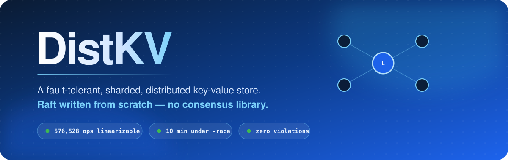
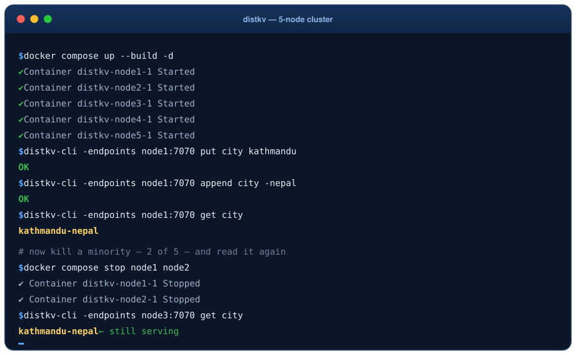
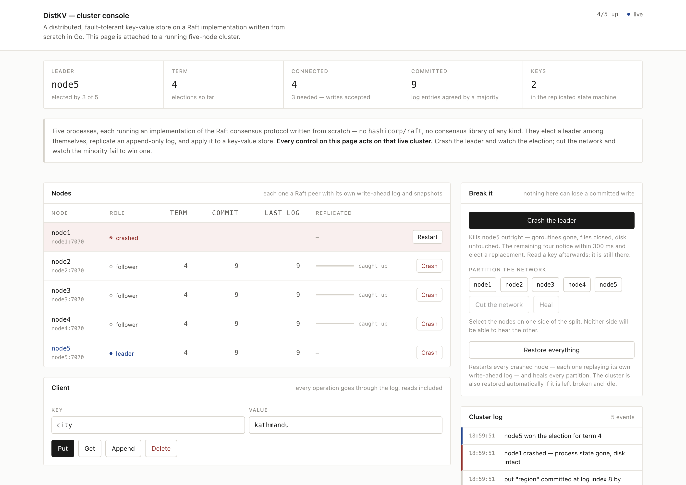
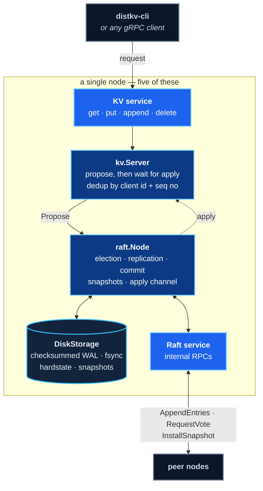
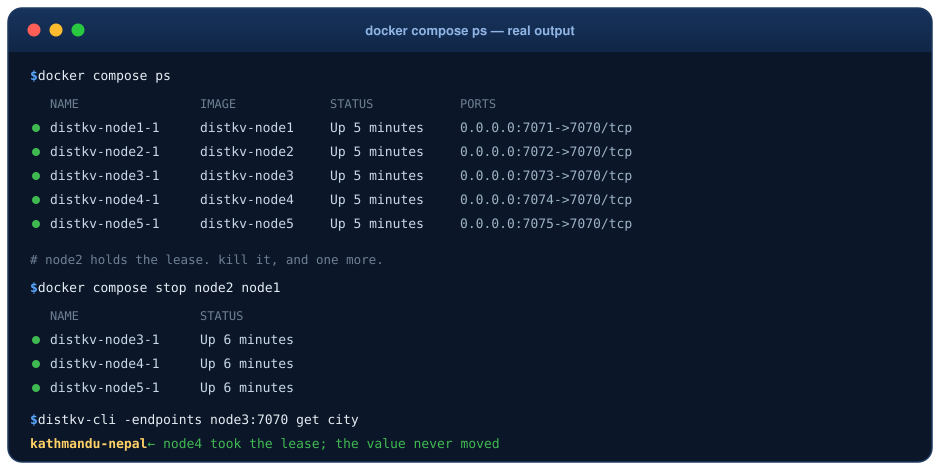
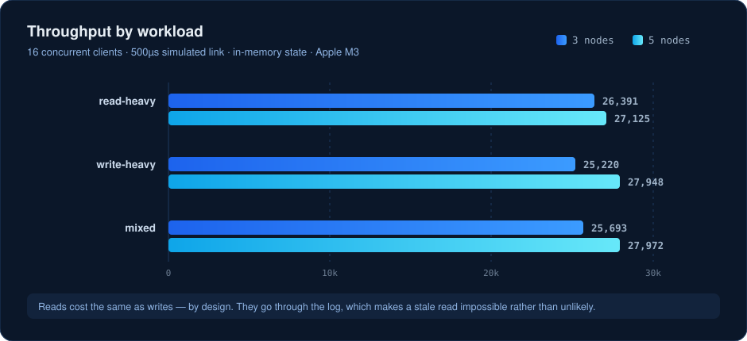
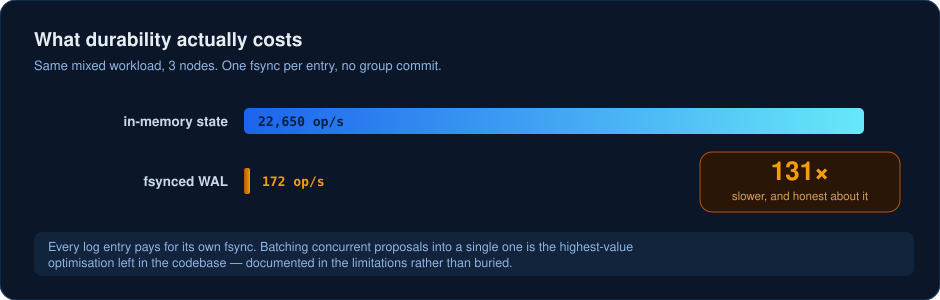

<div align="center">



<br/>

[](http://34.240.41.1:8080)


**No `hashicorp/raft`. No `etcd-io/raft`. No consensus library of any kind.**

Leader election · log replication · crash recovery · snapshots · linearizable reads<br/>
exactly-once semantics · range sharding · verified with [porcupine](https://github.com/anishathalye/porcupine)

<br/>

### **[→ Break a running cluster, right now](http://34.240.41.1:8080)**

Five nodes on a machine in Ireland. Kill the leader and watch the election;
cut the network and watch the minority fail to win one. Nothing is mocked.

</div>

---

## See it work

<div align="center">

</div>

That transcript is real. Every command in this README was run against an actual
five-node cluster — including the part where two nodes die and the store keeps
answering.

---

## The receipt

Most distributed stores claim correctness. This one has a number attached.

> A fault-injection soak test ran concurrent clients against a 5-node cluster
> while a chaos loop continuously **partitioned, crashed, and restarted nodes**
> under a seeded RNG. Every operation was recorded and checked against a
> key-value model with porcupine.
>
> ### **576,528 operations · 10 minutes under `-race` · zero linearizability violations**

```bash
DISTKV_SOAK_DURATION=10m go test -race ./internal/kv/ -run TestLinearizabilitySoak -timeout 30m
```

A failing run prints the seed that reproduces it exactly. And because a soak
that always passes proves nothing, there's a test that feeds the checker a
history it *must* reject — a read returning a value nobody ever wrote.

---

## The console

### **[http://34.240.41.1:8080](http://34.240.41.1:8080)** — live, right now

A browser console attached to a five-node cluster. It is not a mock, a
recording, or a simulation: every number on the page was read off a running node
a fraction of a second earlier, and every button does the thing it says to the
real cluster. `docker compose up` gives you the same thing locally.

<div align="center">

</div>

The point of it is the middle column of that log. **Crash the leader** and you
watch, in order: the node go dark, the remaining four notice within a few
hundred milliseconds, one of them win an election, and the key you wrote thirty
seconds ago come back from a different node than the one that took it.

Three things are worth doing to it:

| | |
|---|---|
| **Crash the leader** | The interesting half of the failure space. Crashing a follower proves almost nothing; crashing the leader forces a real election. The node is genuinely destroyed — goroutines stopped, file handles closed — and **Restart** brings it back by replaying its own write-ahead log, which is the only place its state could come from. |
| **Cut the network 3–2** | The majority side carries on serving. The minority side stands for election, fails, stands again, and drives its term far above the cluster's while winning nothing. Watching those two term numbers diverge *is* the reason Raft requires a majority. |
| **Crash three of five** | The store stops accepting writes and says why. This is the one people skip, and it is the most important: refusing is correct, and a store that answered here would look healthier while being wrong. |

Every key-value operation shows its route — which node it hit, who refused it,
who redirected it where, and the log index it committed at. Run the same `get`
before and after crashing the leader and the difference between the two traces
is the whole failover story in four lines.

Fault injection is rate limited per visitor, the cluster restores itself if it
is left broken and idle, and `-allow-chaos=false` turns the whole thing into a
read-only view. The console holds no state of its own — restart it and it just
starts asking again. The public instance is a shared toy: keys are capped in
size and number, and somebody else may well be crashing a node while you read
this, which is rather the point.

### Run it yourself

```bash
docker compose up --build -d   # console on http://localhost:8080
```

That is five containers, each a node with its own volume, plus the gateway. On
a fresh Linux machine, [`deploy/vm/setup.sh`](deploy/vm/setup.sh) does the whole
thing in one command — Docker, firewall, and a certificate if you give it a
hostname:

```bash
git clone https://github.com/sujalbistaa/DistKV.git && cd DistKV
deploy/vm/setup.sh                      # http://<your-ip>:8080
deploy/vm/setup.sh distkv.example.org   # or with HTTPS
```

[docs/deploy.md](docs/deploy.md) covers the rest: which free tiers this fits
inside and which of them has an expiry date, what to change before it faces the
internet, and a single-container build for platforms that run one container and
expose one port.

---

## Architecture



Two abstractions carry the whole design:

| | |
|---|---|
| **`transport.Transport`** | Every RPC crosses it. gRPC in production; in tests, an in-memory network that **drops, delays, duplicates, reorders, partitions and crashes** under a seeded RNG. The consensus code is identical either way and never sees a protobuf. |
| **`raft.Storage`** | Deliberately granular — `SaveHardState` / `AppendLog` / `TruncateLog` / `SaveSnapshot` / `Load` — so the disk implementation is a genuine append-only write-ahead log instead of rewriting all state on every vote. |

Sharding sits on top: a static range partition of the keyspace, one independent
Raft group per shard, and a router that caches each shard's leader and
invalidates on redirect.

---

## Quick start

```bash
docker compose up --build -d

docker compose exec node1 distkv-cli -endpoints node1:7070 put city kathmandu
docker compose exec node1 distkv-cli -endpoints node1:7070 append city -nepal
docker compose exec node1 distkv-cli -endpoints node1:7070 get city
# kathmandu-nepal
```

Any endpoint works. A node that isn't the leader refuses with the leader's
address, and the client follows the redirect itself.

<div align="center">

</div>

<sub>Verbatim output from a real cluster — five nodes up, then the leader (`node2`) and one more killed, and the value still served by the three that remain. `node4` took the lease.</sub>

<!--
  Optional: a Docker Desktop GUI screenshot can go here too.
  Drop the file at docs/assets/docker-desktop.png and uncomment:

<div align="center">
  
</div>
-->

### Now break it

<table>
<tr><th align="left">What you do</th><th align="left">What happens</th></tr>
<tr>
<td><code>docker compose stop node1 node2</code><br/><sub>kill a minority — 2 of 5</sub></td>
<td>✅ Reads <b>and</b> writes keep working. A majority still exists, so the cluster elects around the loss.</td>
</tr>
<tr>
<td><code>docker compose stop node3</code><br/><sub>now a majority is gone</sub></td>
<td>🛑 Requests <b>fail</b>. It refuses rather than serving a value it can no longer prove is current.</td>
</tr>
<tr>
<td><code>docker compose start node1 node2 node3</code><br/><sub>bring them back</sub></td>
<td>✅ Every key returns — recovered from each node's own write-ahead log, including one written while they were down.</td>
</tr>
</table>

That middle row is the interesting one. Refusing to answer is the *correct*
behaviour, and a store that returned stale data there would look healthier
while being wrong.

### Without Docker

```bash
go build -o bin/distkv-server ./cmd/distkv-server
go build -o bin/distkv-cli ./cmd/distkv-cli

PEERS="n1=127.0.0.1:7071,n2=127.0.0.1:7072,n3=127.0.0.1:7073,n4=127.0.0.1:7074,n5=127.0.0.1:7075"
for i in 1 2 3 4 5; do
  ./bin/distkv-server -id "n$i" -listen "127.0.0.1:707$i" \
    -peers "$PEERS" -data-dir "/tmp/distkv/n$i" &
done

./bin/distkv-cli -endpoints "127.0.0.1:7071" put city kathmandu
./bin/distkv-cli -endpoints "127.0.0.1:7071" get city
```

### Sharding

Pass a shard map and each node joins only the Raft group for the shard that
lists it — see [`config/shards.example.json`](config/shards.example.json):

```bash
distkv-server -id s2n1 -shard-config config/shards.example.json -peers ... -data-dir ...
```

---

## Benchmarks

<div align="center">

</div>

**Read-heavy is not faster than write-heavy, and that's the design showing up in
the data.** Reads are routed through the Raft log, so a `get` costs exactly what
a `put` costs. In exchange, a stale read is impossible by construction rather
than unlikely by argument: a partitioned ex-leader *cannot commit* a read, so it
fails instead of answering from memory it no longer trusts.

Leader re-election after the leader is killed — 5 nodes, 20 trials:

<div align="center">

| min | p50 | p95 | max | mean |
|:---:|:---:|:---:|:---:|:---:|
| 30.99ms | **39.71ms** | 51.39ms | 51.39ms | 39.71ms |

</div>

### The uncomfortable number

<div align="center">

</div>

Turning on real durability costs **131x**. There is no group commit — every log
entry pays for its own `fsync`. Batching concurrent proposals into a single one
is the highest-value optimisation left in the codebase, and it's in the
limitations rather than buried.

Full methodology, hardware, and caveats: **[docs/benchmarks.md](docs/benchmarks.md)**.

---

## Running the tests

```bash
go test -race ./...                # everything, ~1 minute
go test -race ./internal/raft/...  # consensus only
```

What's actually covered:

- **Election** — exactly one leader; a minority partition elects none; an isolated leader steps down on rejoin; no two leaders ever share a term
- **Replication** — the paper's Figure 7 conflict scenario, where an isolated leader's uncommitted entry is truncated and overwritten
- **Persistence** — recovery from a WAL with a **torn trailing record**; a node that voted in term T refuses to vote again after restarting
- **Snapshots** — a follower that fell past the compaction point catching up via `InstallSnapshot`
- **Exactly-once** — a retried append across a leader failover applying exactly once
- **Sharding** — killing a majority of shard 2 while shards 1 and 3 keep serving
- **The real thing** — a cluster over real gRPC, real TCP, real fsynced logs, through a real failover

```bash
# the full soak
DISTKV_SOAK_DURATION=10m go test -race ./internal/kv/ -run TestLinearizabilitySoak -timeout 30m

# the benchmarks, on an idle machine
DISTKV_BENCH_REPORT=1 DISTKV_BENCH_DURATION=5s go test ./bench/ -p 1 -v -timeout 600s
```

---

## Layout

```
cmd/distkv-server/   node binary: Raft peer + KV state machine on one gRPC listener
cmd/distkv-cli/      client: get/put/append/delete, follows leader redirects
cmd/distkv-gateway/  HTTP gateway: cluster view, KV proxying, fault injection
internal/raft/       consensus: elections, replication, persistence, snapshots
internal/storage/    checksummed write-ahead log, hardstate, snapshot files
internal/kv/         replicated KV state machine, dedup sessions, gRPC service
internal/supervisor/ node lifecycle: crash and rebuild in place from the log
internal/gateway/    cluster polling, derived state, event log, HTTP handlers
internal/shard/      shard map, key routing, leader-caching router and client
internal/transport/  RPC abstraction: fake fault-injecting network + gRPC
internal/testutil/   cluster harness, fault injection, linearizability model
web/                 the console: React and TypeScript, no UI framework
deploy/              one-command VM setup, TLS overlay, single-container build
proto/               .proto definitions and generated code
bench/               load generator and benchmark reporting
docs/                design decisions, benchmark results, original build spec
```

---

## Docs

| | |
|---|---|
| **[docs/design.md](docs/design.md)** | The non-obvious decisions: how linearizable reads work and what they cost, how exactly-once is achieved, why commit requires a current-term entry, what the fast-backup optimisation buys, and where the implementation deliberately simplifies. |
| **[docs/benchmarks.md](docs/benchmarks.md)** | Methodology, hardware, and every measured number. |
| **[docs/build-spec.md](docs/build-spec.md)** | The original specification this was built against, milestone by milestone. |
| **[docs/deploy.md](docs/deploy.md)** | Putting the cluster and its console on the internet, and the guardrails that need to be on before you do. |

---

## Limitations

Stated plainly, because finding these yourself later is worse.

- **No group commit** — every log entry gets its own `fsync`, which dominates write throughput
- **No membership changes** — the peer set is fixed at startup; no joint-consensus reconfiguration
- **No shard migration** — assignment is static, as scoped
- **`InstallSnapshot` isn't chunked** — a snapshot ships in one RPC; fine at these sizes, not at multi-gigabyte ones
- **Client sessions never expire** — the dedup table grows without bound
- **No auth or TLS** — connections are insecure gRPC
- **No pre-vote** — a node returning from a partition carries the inflated term it reached while campaigning alone, and forces the cluster into an election it did not need. Section 9.6 of the Raft dissertation is the fix: ask whether you *could* win before incrementing your term. The console makes this one easy to see — partition a node, leave it a while, then heal it and watch the whole cluster jump to its term

---

<div align="center">
<sub>Built milestone by milestone against <a href="docs/build-spec.md">a spec</a>, with every acceptance test passing before the next one started.</sub>
</div>
